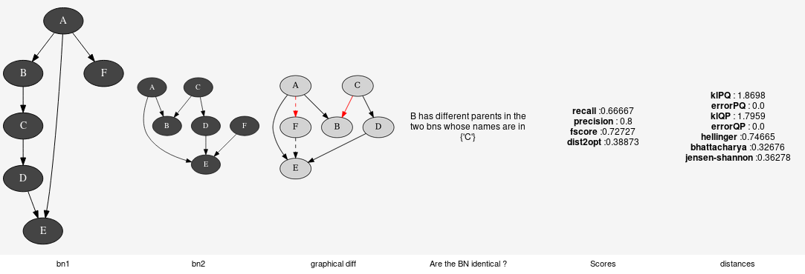

Tools for Bayesian networks
---------------------------

aGrUM/pyAgrum provide a set of classes and functions in order to easely work
with Bayesian networks.

.. toctree::
  :maxdepth: 3

  BNToolsGener
  BNToolsCompar
  BNToolsExplain
  BNToolsFragment
