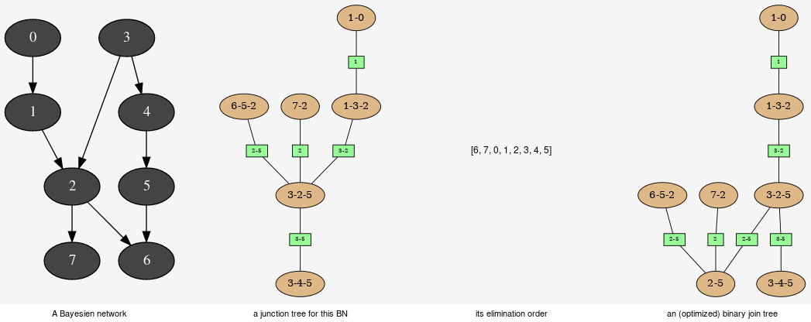

Explanation and analysis
^^^^^^^^^^^^^^^^^^^^^^^^

This tools aimed to provide some different views on the Bayesian network in
order to explore its qualitative and/or quantitave behaviours.

.. autoclass:: pyAgrum.JunctionTreeGenerator

.. autoclass:: pyAgrum.EssentialGraph

.. autoclass:: pyAgrum.MarkovBlanket
