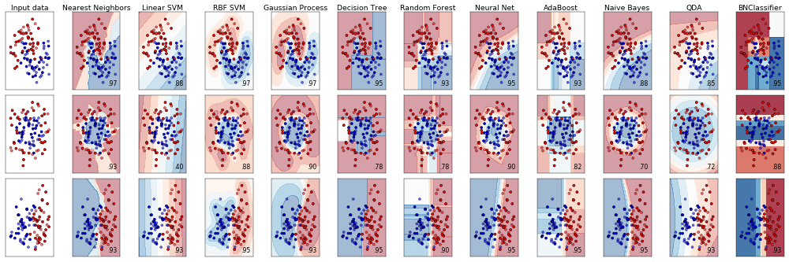

pyAgrum.skbn documentation
============================

Probabilistic classification in pyAgrum aims to propose a scikit-learn-like (binary and multi-class) classifier class that can be used in the same codes as scikit-learn classifiers. Moreover, even if the classifier wraps a full Bayesian network, skbn optimally encodes the classifier using the smallest set of needed features following the d-separation criterion (Markov Blanket).

    An  `example from scikit-learn <https://scikit-learn.org/stable/auto_examples/classification/plot_classifier_comparison.html>`_ where a last column with a BNClassifier has been added flawlessly (see `this notebook <https://lip6.fr/Pierre-Henri.Wuillemin/aGrUM/docs/last/notebooks/41-Classifier_Learning.ipynb.html>`_).

The module proposes to wrap the pyAgrum's learning algorithms and some others (naive Bayes, TAN, Chow-Liu tree) in the fit method of a classifier. In order to be used with continuous variable, the module proposes also some different discretization methods.

skbn is a set of pure python3 scripts based on pyAgrum's tools.

**Tutorials**

* Notebooks on `scikit-learn-like classifiers in pyAgrum <https://lip6.fr/Pierre-Henri.Wuillemin/aGrUM/docs/last/notebooks/41-Classifier_Learning.ipynb.html>`_, the `integration in scikit-learn codes <https://lip6.fr/Pierre-Henri.Wuillemin/aGrUM/docs/last/notebooks/44-Classifier_CompareClassifiersWithSklearn.ipynb.html>`_  and, as an example, `cross-validation with scikit-learn <https://lip6.fr/Pierre-Henri.Wuillemin/aGrUM/docs/last/notebooks/45-Classifier_CrossValidation.ipynb.html>`_

* An `example from Kaggle <https://lip6.fr/Pierre-Henri.Wuillemin/aGrUM/docs/last/notebooks/43-Classifier_KaggleTitanic.ipynb.html>`_,

* Notebook on `Discretizers in pyAgrum <https://lip6.fr/Pierre-Henri.Wuillemin/aGrUM/docs/last/notebooks/42-Classifier_Discretizer_notebook.ipynb.html>`_ useful for scikit-learn-like classifiers.

**Reference**

.. toctree::
   :maxdepth: 3

   skbnClassifier
   skbnDiscretizer
