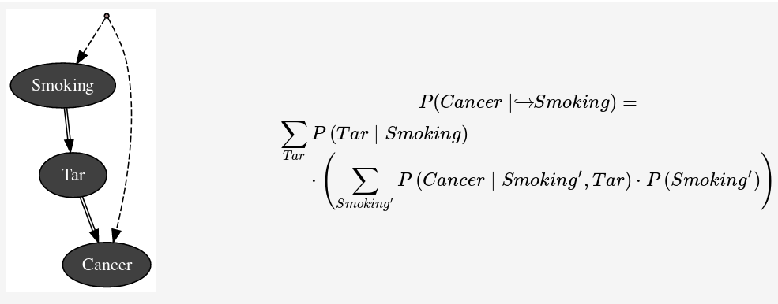

pyAgrum.skbn documentation
============================

Probabilistic classification in pyAgrum aims to propose a scikit-learn classifier class that can be used in the same codes as sklearn classifiers. Moreover, once the graphical models is built, skbn optimally code the classifier using the smallest set of features needed following the d-separation critretion (Markov Blanket).
The module proposes to wrap the pyAgrum's learning algorithm and add some others (naive Bayes, TAN, Chow-Liew tree) in the fit method of a classifier. In order to be used with continuous variable, the module proposes also some different discretization methods.  

skbn is a set of pure python3 scripts based on pyAgrum's tools.

**Tutorial**

* `Notebooks on causality in pyAgrum <http://webia.lip6.fr/~phw/aGrUM/docs/last/notebooks/51-Causality_Tobacco.ipynb.html>`_
* Some `implemented examples <https://webia.lip6.fr/~phw//aGrUM/BookOfWhy/>`_ from the `book of Why <http://bayes.cs.ucla.edu/WHY/>`_ from Judea Pearl and Dana Mackenzie. 

**Reference**

.. toctree::
   :maxdepth: 3

   skbnClassifier
   skbnDiscretizer
