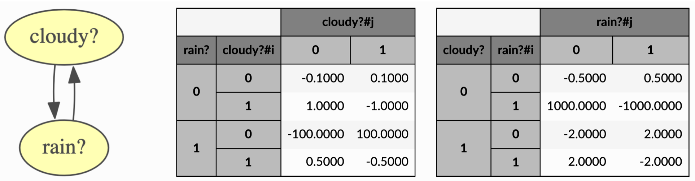

Continuous-Time Bayesian Networks
=================================

A CTBN(Continuous-Time Bayesian Networks) is a graphical model that allows a Bayesian Network to evolve over continuous time.
This pyAgrum library offers ways to create such models, to have a graphical representation but also to learn such models
(the dependency between variables and their distribution parameters) using exact inference and sampling as well. To this day
*Forward Sampling* is the only sampling method available.

The goal is to have the properties of a discrete *Markov Chain* but at continuous time, which means that a random variable is allowed
to switch state at any time. To depict the time a variable spends in a state before switching to another, we use an exponential distribution.

**Tutorials**

* `Notebooks on CTBNs in pyAgrum <notebooks/71-PyModels_CTBN>`_.

**Reference**

.. toctree::
   :maxdepth: 3

   ctbnModel
   ctbnInference
   ctbnGraphical
   ctbnLearner
