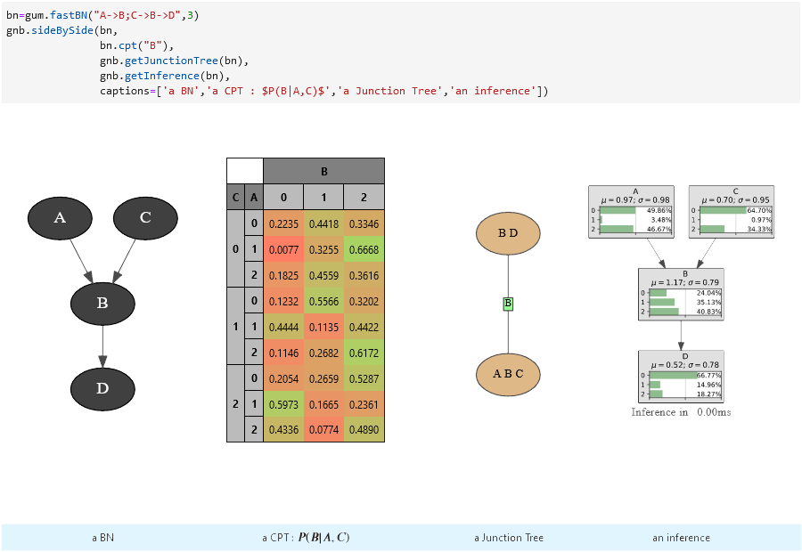

.. pyAgrum documentation master file, created by
   sphinx-quickstart on Mon Oct 17 16:59:01 2016.
   You can adapt this file completely to your liking, but it should at least
   contain the root `toctree` directive.

Introduction to pyAgrum
=======================

.. figure:: _static/agrum.png
    :align: right
    :alt: aGrUM
    :target: http://agrum.org

`pyAgrum <http://agrum.org>`_ a scientific C++ and Python library dedicated to 
Bayesian networks and other Probabilistic Graphical Models. Based on the C++
`aGrUM <https://agrum.lip6.fr>`_ library, it provides a high-level interface to 
the C++ part of aGrUM allowing to create, manage and perform efficient computations 
with Bayesian networks  and others probabilsitic graphical models (Markov networks, 
influence diagrams and LIMIDs, dynamic BN, probabilistic relational models).

The module is generated using the `SWIG <https://www.swig.org>`_ interface 
generator. Custom-written code was added to make the interface more 
user friendly.

pyAgrum aims to allow to easily use (as well as to prototype new algorithms on) 
Bayesian network and other graphical models.

pyAgrum contains
  * a `comprehensive API documentation <https://pyagrum.readthedocs.io>`_,
  * `tutorials as jupyter notebooks <http://www-desir.lip6.fr/~phw/aGrUM/docs/last/notebooks/01-tutorial.ipynb.html>`_,
  * a `gitlab repository <https://gitlab.com/agrumery/aGrUM>`_,
  * and a `website <http://agrum.org>`_.

.. toctree::
  :caption: Fundamental components
  :maxdepth: 2

  graph
  randomVariables
  potential

.. toctree::
  :caption: Graphical Models
  :maxdepth: 2

  bayesianNetwork
  markovNetwork
  influenceDiagram
  PRM
  credalNetwork

.. toctree::
  :caption: Causality
  :maxdepth: 2
  :titlesonly:

  Causal

.. toctree::
  :caption: scikit-learn-like BN Classifiers
  :maxdepth: 2
  :titlesonly:

  Classifier

.. toctree::
  :caption: pyAgrum.lib modules
  :maxdepth: 2
  :titlesonly:

  lib.notebook
  lib.bn2graph
  lib.dBN
  pyAgrum.lib

.. toctree::
  :caption: Miscellaneous
  :maxdepth: 2
  
  functions
  miscellaneous
  exceptions

.. toctree::
  :caption: Customizing pyAgrum
  :maxdepth: 2

  PyAgrumConfiguration

Indices and tables
==================

* :ref:`genindex`
* :ref:`modindex`
* :ref:`search`
