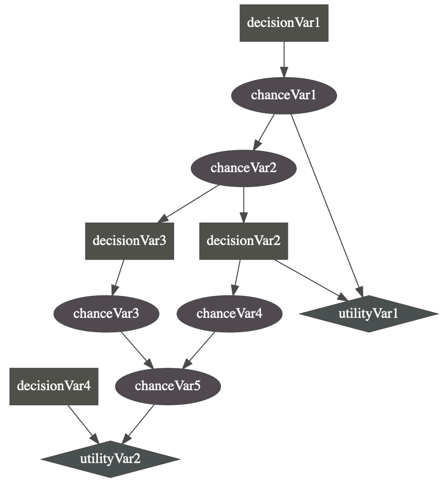

Influence Diagram
=================

  
An influence diagram is a compact graphical and mathematical representation of a decision situation. It is a generalization of a Bayesian network, in which not only probabilistic inference problems but also decision making problems (following the maximum expected utility criterion) can be modeled and solved. It includes 3 types of nodes : action, decision and utility nodes (`from wikipedia <https://en.wikipedia.org/wiki/Influence_diagram>`_).

PyAgrum's so-called influence diagram represents both influence diagrams and LIMIDs. The way to enforce that such a model represent an influence diagram and not a LIMID belongs to the inference engine.

**Tutorial**

* `Tutorial on Influence Diagram <http://webia.lip6.fr/~phw/aGrUM/docs/last/notebooks/34-InfluenceDiagram.ipynb.html>`_

**Reference**

Model
-----
.. autoclass:: pyAgrum.InfluenceDiagram
			:members:
			:exclude-members: setProperty, property, propertyWithDefault

Inference
---------
.. autoclass:: pyAgrum.ShaferShenoyLIMIDInference
			:members:
