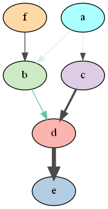

Module bn2graph
===============

.. automodule:: pyAgrum.lib.bn2graph

.. code-block:: python
  :linenos:

  bn = gum.fastBN("a->b->d;a->c->d->e;f->b")
  g = BNinference2dot(bn,
                      targets=['f', 'd'],
                      vals={'a': 1,
                            'b': 0.3,
                            'c': 0.3,
                            'd': 0.1,
                            'e': 0.1,
                            'f': 0.3},
                      arcvals={(0, 1): 2,
                               (0, 2): 0.5})
  g.write("test.png", format='png')

Visualization of Potentials
---------------------------

.. autofunction:: pyAgrum.lib.bn2graph.proba2histo

Visualization of Bayesian networks
----------------------------------

.. autofunction:: pyAgrum.lib.bn2graph.BN2dot
.. autofunction:: pyAgrum.lib.bn2graph.BNinference2dot

Hi-level functions
------------------
.. autofunction:: pyAgrum.lib.bn2graph.dotize
.. autofunction:: pyAgrum.lib.bn2graph.pngize
.. autofunction:: pyAgrum.lib.bn2graph.pdfize
