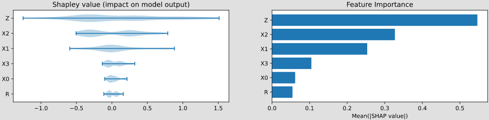

pyAgrum.lib.explain
===================

The purpose of ``pyAgrum.lib.explain`` is to give tools to explain and interpret the structure and parameters of a Bayesian network.

Dealing with independence
-------------------------

.. autofunction:: pyAgrum.lib.explain.independenceListForPairs
.. autofunction:: pyAgrum.lib.explain.plotIndependenceListForPairs

Dealing with mutual information and entropy
-------------------------------------------

.. autofunction:: pyAgrum.lib.explain.getInformation
.. autofunction:: pyAgrum.lib.explain.showInformation

Dealing with ShapValues
-----------------------

.. autoclass:: pyAgrum.lib.explain.ShapValues
    :members:
    :undoc-members:
    :show-inheritance:
    :noindex:
