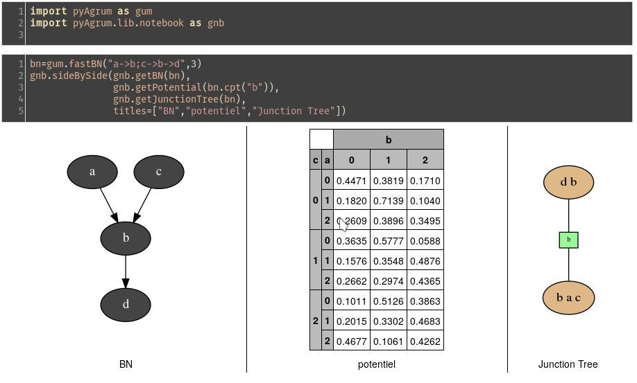

.. pyAgrum documentation master file, created by
   sphinx-quickstart on Mon Oct 17 16:59:01 2016.
   You can adapt this file completely to your liking, but it should at least
   contain the root `toctree` directive.

Introduction to pyAgrum
=======================

`pyAgrum <https://pyagrum.lip6.fr>`_ is a Python wrapper for the C++ `aGrUM <https://agrum.lip6.fr>`_ library.
It provides a high-level interface to the part of aGrUM allowing to create, handle and make computations into Bayesian Networks.

The module is generated using the `SWIG <https://www.swig.org>`_ interface generator. Custom-written code was added to make
the interface more friendly.

pyAgrum aims to allow modeling as well as prototyping new algorithms on bayesian network and other graphical models.

pyAgrum contains
  * a `comprehensive API documentation <http://www-desir.lip6.fr/~phw/aGrUM/dev/pdoc/>`_,
  * `examples as notebooks <http://www-desir.lip6.fr/~phw/aGrUM/officiel/notebooks/>`_,
  * and a `website <https://forge.lip6.fr/projects/pyagrum/wiki>`_.

pyAgrum library
===============

.. toctree::
  :maxdepth: 3
  :titlesonly:

  functions
  graphModule
  randomVariablesAndPotentials
  bayesianNetwork

Python helpers : pyAgrum.lib
============================

pyAgrum.lib is a set of python tools.

.. toctree::
  :maxdepth: 2
  :titlesonly:

  lib.notebook
  lib.dBN

Indices and tables
==================

* :ref:`genindex`
* :ref:`modindex`
* :ref:`search`

.. Exhaustif but not usable
.. =====================
.. .. toctree::
..     pyAgrum
..     pyAgrum.lib
