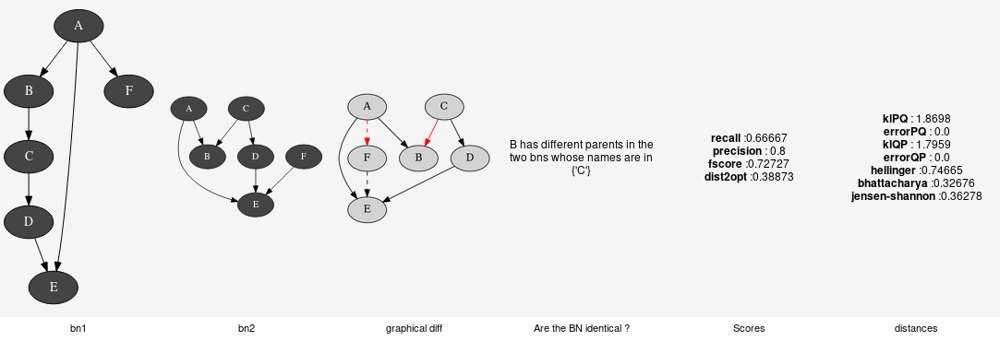

Comparison of Bayesian networks
^^^^^^^^^^^^^^^^^^^^^^^^^^^^^^^

To compare Bayesian networks, one can compare their structure
(see :class:`pyagrum.lib.bn_vs_bn.GraphicalBNComparator`).
However BNs can also be compared as probability distributions.

.. autoclass:: pyagrum.ExactBNdistance

.. autoclass:: pyagrum.GibbsBNdistance

.. seealso::

   :doc:`pyAgrum.lib`
      :class:`pyagrum.lib.bn_vs_bn.GraphicalBNComparator` for structural comparison of two Bayesian networks.
