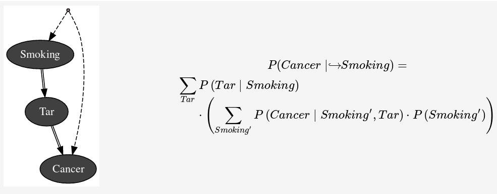

Causal Model in pyAgrum
=======================

Causality in pyAgrum primarily involves building a causal model—that is, constructing an (observational) Bayesian network along with a set of latent variables and defining their relationships with observed variables. It also includes the ability to compute causal effects in such models using do-calculus.

pyAgrum provides a set of tools to perform causal inference and estimate causal effects from data. This includes the ability to identify interventions, compute causal impacts, and evaluate the effects of interventions on observed variables.

.. note::
    The causal module can use a LaTeX special arrow (:math:`\hookrightarrow`) to compactly represent an intervention. By default, it uses the classical "do" notation. You can change this behavior using the following configuration keys:

    .. code-block:: python

            pyagrum.config["causal","latex_do_prefix"]="\hookrightarrow("
            pyagrum.config["causal","latex_do_suffix"]=")"

A :class:`pyagrum.CausalModel` extends a :class:`pyagrum.BayesNet` with latent (hidden) variables
and explicit causal assumptions. It is the entry point for do-calculus reasoning and causal effect
identification.

.. seealso::

   :doc:`CausalInference`
      Functions for computing causal impacts and applying do-calculus.

.. autoclass:: pyagrum.CausalModel
