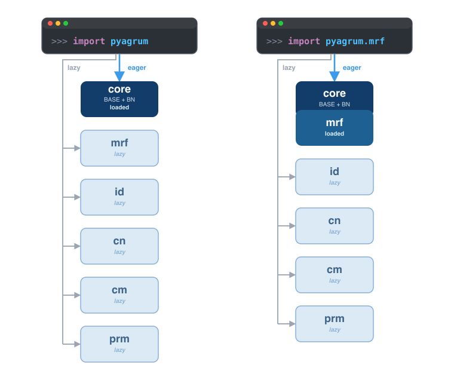

pyAgrum's modular architecture
===============================

    ``import pyagrum`` loads the core eagerly and only *registers* the five
    submodules (lazy); ``import pyagrum.mrf`` (or any other submodule) loads
    the core **and** that submodule eagerly, the others staying lazy.

.. note::
  This page is only about the **compiled part** of pyAgrum: the C++/aGrUM
  code exported through SWIG. ``pyagrum`` is not a single compiled
  extension: it is a lightweight **core** (Bayesian networks and every
  fundamental component -- graphs, variables, tensors...) plus five
  **optional submodules**, one per probabilistic graphical model family
  beyond BN, each compiled as its own independent extension.

  pyAgrum also ships several **pure-Python** modules -- :doc:`pyagrum.lib
  <pyAgrum.lib>` (notebook display, image export, ...),
  :doc:`pyagrum.causal <CausalModel>`, :doc:`pyagrum.ctbn <ctbn>`,
  :doc:`pyagrum.clg <clg>`, :doc:`pyagrum.bnmixture <bnmixture>`,
  ``pyagrum.skbn``, :doc:`pyagrum.explain <explain>`... These are ordinary
  Python packages layered on top of the compiled core: plain ``import``
  statements, no lazy-loading shim, nothing described on this page applies
  to them.

.. list-table::
    :class: method-summary
    :align: left
    :widths: 15 45 25 15
    :header-rows: 1

    * - Package
      - Content
      - Main classes
      - Reachable lazily?
    * - ``pyagrum``
      - core: graphs, variables, :class:`~pyagrum.Tensor`, Bayesian networks,
        BN inference and learning
      - :class:`~pyagrum.BayesNet`, :class:`~pyagrum.LazyPropagation`,
        :class:`~pyagrum.BNLearner`...
      - always loaded
    * - ``pyagrum.mrf``
      - :doc:`Markov random fields <markovRandomField>`
      - ``MarkovRandomField``, ``ShaferShenoyMRFInference``
      - yes
    * - ``pyagrum.id``
      - :doc:`Influence diagrams and LIMIDs <infdiag>`
      - ``InfluenceDiagram``, ``ShaferShenoyLIMIDInference``, ``IDGenerator``
      - yes
    * - ``pyagrum.cn``
      - :doc:`Credal networks <credalNetwork>`
      - ``CredalNet``, ``CNLoopyPropagation``, ``CNMonteCarloSampling``
      - yes
    * - ``pyagrum.cm``
      - :doc:`Causal models <CausalModel>` (causal inference,
        counterfactuals)
      - ``CausalModel``, ``CausalImpact``, ``Counterfactual``
      - yes
    * - ``pyagrum.prm``
      - :doc:`Probabilistic relational models <PRM>` (o3prm)
      - ``PRMexplorer``
      - partially (see below)

Splitting the C++/SWIG extension this way keeps a plain ``import pyagrum``
fast and light: a script that only ever builds and queries Bayesian networks
never pays the cost of loading the credal-network or causal-inference
machinery.

Two ways to use a submodule
----------------------------

**1. Just use it -- lazy loading.** Every class and function above is
directly reachable from the ``pyagrum`` namespace, without importing the
submodule explicitly:

.. code-block:: python

    import pyagrum as gum

    mrf = gum.MarkovRandomField()  # transparently imports pyagrum.mrf on first use
    ie = gum.ShaferShenoyMRFInference(mrf)

The first access to a name owned by a submodule (``MarkovRandomField``,
``InfluenceDiagram``, ``CredalNet``, ``CausalModel``...) imports that
submodule behind the scenes and caches the result -- every later access is a
plain attribute lookup, no import overhead. If the submodule was excluded
from the build (see :ref:`optional-submodules` below), the same call raises
an ``AttributeError`` instead of silently doing nothing.

**2. Scope the import explicitly.** Each submodule can also be imported on
its own, as a drop-in superset of the core namespace:

.. code-block:: python

    import pyagrum.mrf as gum

    bn = gum.BayesNet()               # still available: the core is re-exported
    mrf = gum.MarkovRandomField()      # no lazy-loading step needed, already imported

This is exactly the pattern used throughout pyAgrum's own test suite for
single-model scripts: it documents at the top of the file which model
family is in use, and avoids the (negligible but nonzero) first-access
import cost.

The lazy-loading mechanism
---------------------------

The trick is a module-level ``__getattr__`` on ``pyagrum`` itself (`PEP 562
<https://peps.python.org/pep-0562/>`_): accessing an attribute that is not
already defined in the core namespace triggers a lookup in a small table
mapping names to the submodule that owns them, imports that submodule with
``importlib``, and re-binds the name directly into ``pyagrum``'s namespace
so every subsequent access skips the indirection entirely. This is the same
mechanism used by other lazily-loaded packages: the submodule is only ever
imported if the program actually uses it.

A handful of convenience type aliases -- ``DirectedModel``, ``PGM``,
``MRFInference``, ``CNInference``, ``IDInference`` -- span *several*
submodules at once (e.g. ``PGM`` covers BN, MRF, ID and CN). Accessing one
of these imports every submodule it spans, not just one; they are rarely
needed in everyday code and mostly useful for type annotations.

.. _optional-submodules:

Optional submodules
--------------------

Each submodule can be excluded from a given pyAgrum build (see the
``PYAGRUM_WITH_MRF`` / ``_ID`` / ``_CN`` / ``_CM`` / ``_PRM`` build options)
-- for instance a minimal deployment that only ever needs Bayesian networks.
When a submodule was left out, accessing any of its names raises a plain
``AttributeError`` rather than an import error deep in unrelated code, and
``import pyagrum.mrf`` (etc.) fails with the usual ``ModuleNotFoundError``.

The ``pyagrum.prm`` special case
----------------------------------

``pyagrum.prm`` behaves slightly differently from the other four submodules.
Its ``PRMexplorer`` class is reachable lazily like everything else, but
O3PRM file support on :class:`~pyagrum.BayesNet` --
``BayesNet.loadO3PRM``/``saveO3PRM``, and the ``"O3PRM"`` extension of
:func:`~pyagrum.loadBN`/:func:`~pyagrum.saveBN` -- is *not*: these methods
only exist once ``pyagrum.prm`` has actually been imported, because
``pyagrum.prm`` attaches them onto the core ``BayesNet`` class itself on
import rather than exposing them as free-standing names. Calling
``gum.loadBN("model.o3prm")`` without ever having imported ``pyagrum.prm``
raises an explicit error asking for ``import pyagrum.prm``:

.. code-block:: python

    import pyagrum as gum

    gum.loadBN("model.o3prm")
    # InvalidArgument: loading a .o3prm file requires 'import pyagrum.prm' first

    import pyagrum.prm  # registers BayesNet.loadO3PRM/saveO3PRM
    gum.loadBN("model.o3prm")  # now works
