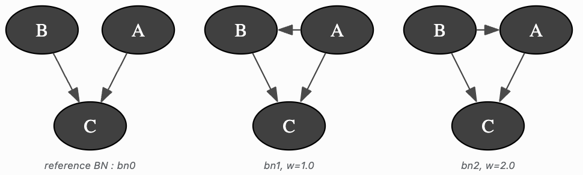

Bayesian Network Mixture
========================

A Mixture of BNs is a list of BNs, each one having its own weight. There are 2 types of mixtures yet.
Both inherit a mother :class:`pyagrum.bnmixture.IMixture`, most functions are the same, the main difference is the purpose :
    - BNMixture : Used with known BNs or databases to compare different instances of the same model. Inference and learning are the same as for BN, but for many BNs at once.
    - BootstrapMixture : Used with one BN or database which becomes the reference BN. All the other BNs added are bootstrap-generated (bootstrap is a method of resampling used to get estimators when the database is limited). When learning BNs, default weight is 1.

**Bootstrap sampling**
Bootstrap is an inference method used to get estimators for parameters (mean, quantiles values, variance).
Idea : Start from a database with :math:`\textbf{N}` samples. From this database we can learn a bayesian network. But is the database reliable? Bootstrap allows us to find out.
From the database, we create :math:`\textbf{B}` other databases, each one is obtained by sampling the original database with replacement until we have :math:`\textbf{N}` samples. Once we have all :math:`\textbf{B}` database, we can learn a bayesian network from each one. If the original database is reliable, there should not be too many differences between the BN learned from the original samples and the re-sampled ones. On the contrary if the original database isn't good/accurate, we can have many differences in all learned BN. An indicator of difference is the number of arcs. For example, let's say that :math:`A\rightarrow B` is in the learned BN from the original database. We have high confidence in the arc if it appears often in the other BNs. On the contrary if the arc :math:`B\rightarrow C` isn't in the BN from the original database but in almost all other BNs, we are less confident that the arc was correctly learned.
Bootstrap can allow for more accuracy about the result when the database is limited.

**tutorials**

* `Notebooks on Mixturess in pyAgrum <notebooks/73-PyModels_BNMixture.html>`_.

**Reference**

.. toctree::
   :maxdepth: 3

   bnmixtureModel
   bnmixtureInference
   bnmixtureLearning
