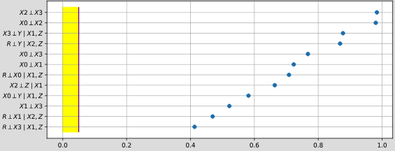
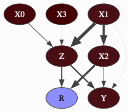
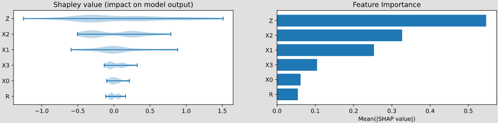
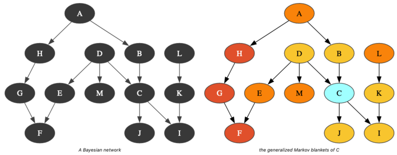

pyagrum.explain
===============

The purpose of ``pyagrum.explain`` is to give tools to explain and interpret the structure and
parameters of a Bayesian network.

Dealing with independence
-------------------------

.. autofunction:: pyagrum.explain.independenceListForPairs

Dealing with mutual information and entropy
-------------------------------------------

.. autofunction:: pyagrum.explain.getInformation
.. autofunction:: pyagrum.explain.getInformationGraph
.. autofunction:: pyagrum.explain.showInformation

Dealing with Shap Values and Shall Values
-----------------------------------------

All attribution methods return an :class:`~pyagrum.explain.Explanation` object, which maps
feature names to their individual attribution values and carries auxiliary data from the
computation.

.. autoclass:: pyagrum.explain.Explanation
   :no-members:
   :no-inherited-members:

Shap Values
~~~~~~~~~~~

Shap (SHapley Additive exPlanations) values decompose a model prediction into the additive
contributions of each feature, based on the Shapley value from cooperative game theory.
Three variants are available depending on how feature interactions are handled:

.. autoclass:: pyagrum.explain.MarginalShapValues
    :members:
    :undoc-members:
    :show-inheritance:

.. autoclass:: pyagrum.explain.ConditionalShapValues
    :members:
    :undoc-members:
    :show-inheritance:

.. autoclass:: pyagrum.explain.CausalShapValues
    :members:
    :undoc-members:
    :show-inheritance:

Shall Values
~~~~~~~~~~~~

Shall (SHapley Additive Log-Likelihood) values are a pyAgrum-specific explanation method.
Where Shap values attribute a *prediction*, Shall values attribute the *log-likelihood of a
baseline observation*: they decompose :math:`\log P(e)` — the log-probability of an evidence
:math:`e` — into the additive contribution of each variable. This makes them particularly
suited for explaining *why* a given observation is more or less probable under the model,
rather than explaining a prediction output.

The same three variants (marginal, conditional, causal) are available:

.. autoclass:: pyagrum.explain.MarginalShallValues
    :members:
    :undoc-members:
    :show-inheritance:

.. autoclass:: pyagrum.explain.ConditionalShallValues
    :members:
    :undoc-members:
    :show-inheritance:

.. autoclass:: pyagrum.explain.CausalShallValues
    :members:
    :undoc-members:
    :show-inheritance:

Dealing with generalized Markov Blankets
----------------------------------------

A structural property of Bayesian networks is the Markov boundary of a node. A Markov blanket of a node is a set of nodes that renders the node independent of all other nodes in the network. The Markov boundary is the closest Markov blanket. A Markov boundary of a node is composed of its parents, its children, and the parents of its children. More generally, one can define the generalized :math:`k`-Markov blanket of a node as the union of the markov blanket of the nodes of its :math:`(k-1)`-Markov blanket. So, if a node belongs to the :math:`k`-Markov blanket of the node :math:`X`, :math:`k` is a kind of measure of its proximity to :math:`X`.

.. autofunction:: pyagrum.explain.generalizedMarkovBlanket
