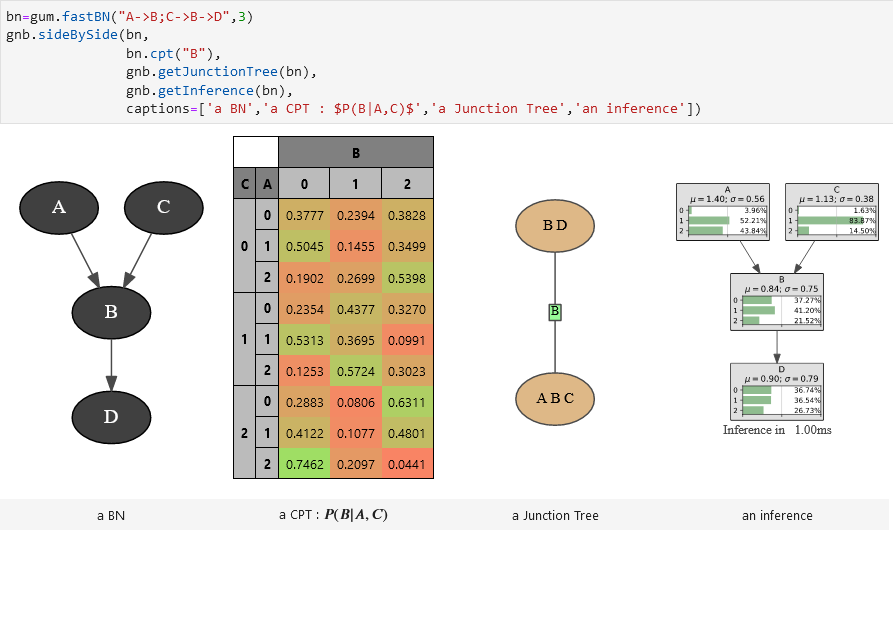

Introduction to pyAgrum
=======================

.. figure:: _static/agrum.png
    :align: right
    :alt: aGrUM
    :target: http://agrum.org

`pyAgrum <http://agrum.org>`_ is a scientific C++ and Python library dedicated to
Bayesian networks (BN) and other Probabilistic Graphical Models. Based on the C++
`aGrUM <https://agrum.lip6.fr>`_ library, it provides a high-level interface to
the C++ part of aGrUM allowing to create, manage and perform efficient computations
with Bayesian networks  and others probabilistic graphical models : Markov random fields (MRF),
influence diagrams (ID) and LIMIDs, credal networks (CN), dynamic BN (dBN), probabilistic relational models (PRM).

.. important::
  Since pyAgrum 2.0.0, the package name follows PEP8 rules and is now `pyagrum` (lowercase). 
  Please use ``import pyagrum`` instead of ``import pyAgrum`` in your code.

  See the `CHANGELOG <https://gitlab.com/agrumery/aGrUM/-/blob/master/CHANGELOG.md>`_  for more details.

The module is generated using the `SWIG <http://www.swig.org>`_ interface
generator. Custom-written code was added to make the interface more
user friendly.

pyAgrum aims to allow to easily use (as well as to prototype new algorithms on)
Bayesian network and other graphical models.

pyAgrum contains :
  * :ref:`tutorials as jupyter notebooks <Notebooks>`.
  * a :ref:`comprehensive API documentation <Reference manual>`.
  * a `gitlab repository <https://gitlab.com/agrumery/aGrUM>`_.
  * and a `website <http://agrum.org>`_.

.. toctree::
  :caption: Tutorials and notebooks
  :name: Notebooks
  :titlesonly:
  :maxdepth: 1

  notebooks

Reference manual
================

.. toctree::
  :caption: 1- Fundamental components
  :maxdepth: 2

  graph
  randomVariables
  tensor

.. toctree::
  :caption: 2- Bayesian networks
  :maxdepth: 2

  BNModel
  BNInference
  BNLearning
  BNTools
  Classifier

.. toctree::
  :caption: 3- Causality

  Causal
  CausalEffectEstimation

.. toctree::
  :caption: 4- Other graphical models
  :maxdepth: 2

  infdiag
  credalNetwork
  markovRandomField
  PRM

.. toctree::
  :caption: 5- pyAgrum's (experimentals) models
  :maxdepth: 2

  ctbn
  clg
  bnmixture

.. toctree::
  :caption: 6- pyagrum.lib modules
  :maxdepth: 2
  :titlesonly:

  lib.notebook
  lib.discreteTypeProcessor
  lib.image
  lib.explain
  lib.dBN
  pyagrum.lib

.. toctree::
  :caption: 7- pyAgrum's tools
  :maxdepth: 2
  :titlesonly:

  random
  fastSyntax
  functions
  listeners
  exceptions

.. toctree::
  :caption: 6- Customizing pyAgrum
  :maxdepth: 1
  :titlesonly:

  PyAgrumConfiguration

.. toctree::
  :caption: Appendices
  :maxdepth: 1

  bibliography
  glossary
  alpha_index
