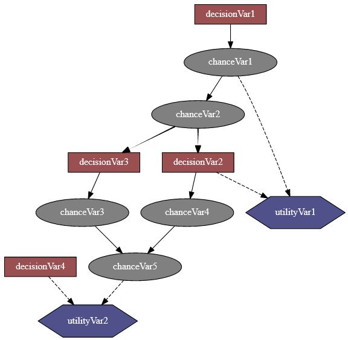

Influence Diagram and LIMIDS
============================

An influence diagram is a compact graphical and mathematical representation of a decision situation. It is a generalization of a Bayesian network, in which not only probabilistic inference problems but also decision making problems (following the maximum expected utility criterion) can be modeled and solved. It includes 3 types of nodes : action, decision and utility nodes (`from wikipedia <https://en.wikipedia.org/wiki/Influence_diagram>`_).

PyAgrum's so-called influence diagram represents both influence diagrams and LIMIDs. The way to enforce that such a model represent an influence diagram and not a LIMID belongs to the inference engine.

**Tutorial**

* `Tutorial on Influence Diagram <notebooks/21-Models_InfluenceDiagram.ipynb>`_

**Input / Output**

Influence diagrams can be saved and loaded using the native :ref:`jgum-bgum-format` (recommended) or the BIFXML format.

.. code-block:: python

   import pyagrum as gum

   id_ = gum.fastID("A->C->*D->$U;A->$U")
   gum.saveID(id_, "model.jgum")   # jgum (JSON)
   gum.saveID(id_, "model.bgum")   # bgum (binary)
   id2 = gum.loadID("model.jgum")

**Reference**

.. toctree::
   :maxdepth: 3

   infdiagModel
   infdiagInference
