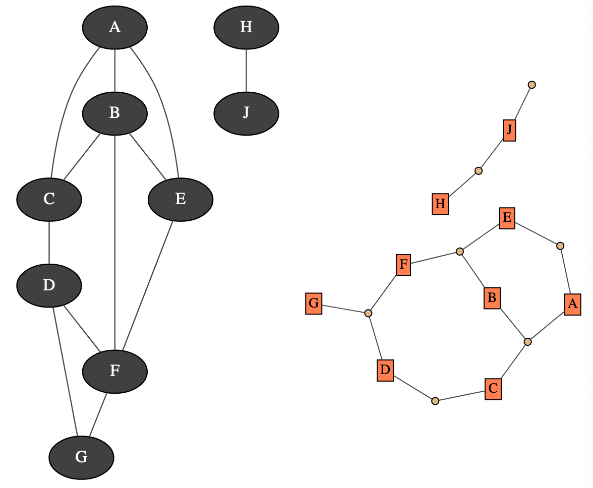

Markov random field
===================

A Markov random field is a undirected probabilistic graphical model. It represents a joint distribution over a set of random variables. In pyAgrum, the variables are (for now) only discrete.

A Markov random field uses a undirected graph to represent conditional independence in the joint distribution. These conditional independence allow to factorize the joint distribution, thereby allowing to compactly represent very large ones.

.. math::
   P(X_1,\cdots,X_n)\propto\prod_{i=1}^{n_c} \phi_i(C_i)

Where the :math:`\phi_i` are tensors over the :math:`n_c` cliques of the undirected graph.

Moreover, inference algorithms can also use this graph to speed up the computations.

.. note::
  `Markov Random Field` are alse called `Markov Network`. After tag 1.5.2, pyAgrum uses the terminology `Markov Random Field`.
  
**Tutorial**

* `Tutorial on Markov random field <notebooks/23-Models_MarkovRandomField.ipynb>`_

**Reference**

.. toctree::
   :maxdepth: 3

   MRFModel

   MRFInference
